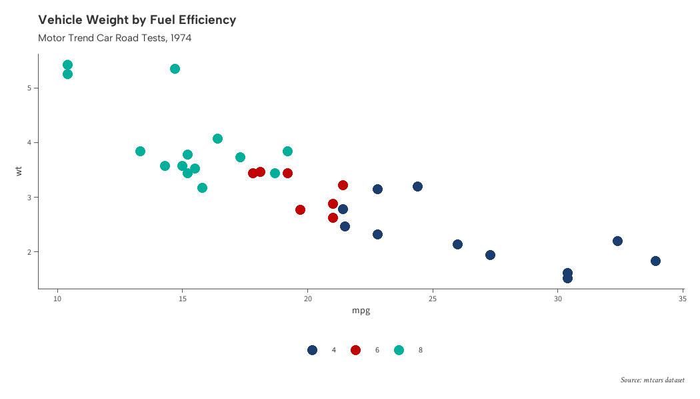
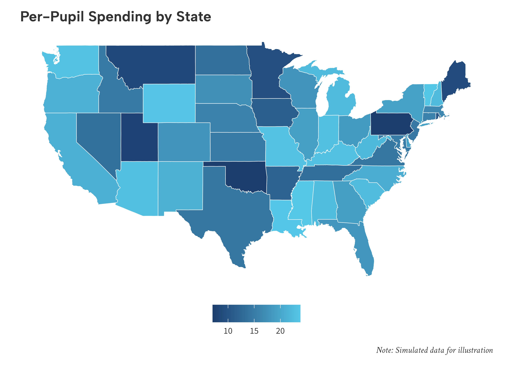
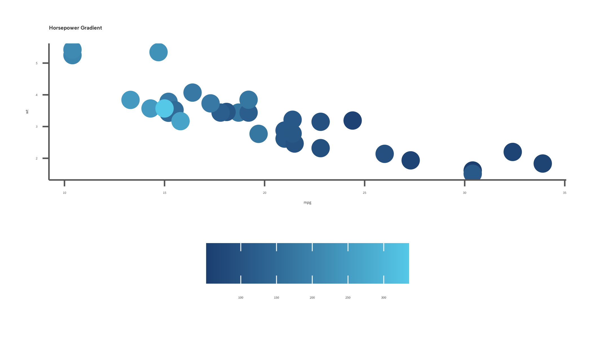
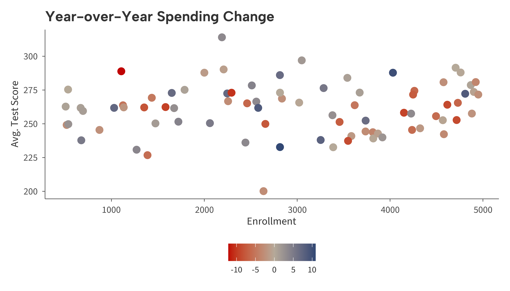

<!-- README.md is generated from README.Rmd. Please edit that file -->

# ggaib

ggplot2 themes and color scales for the Annenberg Institute at Brown
University.

## Installation

``` r
# install.packages("devtools")
devtools::install_github("andrewmcamp/ggaib")
```

## Brand Colors

``` r
library(ggaib)
#> Brand fonts not found. Using bundled alternatives (Albert Sans, Source Sans 3, Crimson Text).
library(ggplot2)
#> Warning: package 'ggplot2' was built under R version 4.5.2

aib_colors()
#>      navy       red   emerald    yellow       sky     taupe     brown      gray 
#> "#1B3E6F" "#C00404" "#00AF9A" "#EBA900" "#55C8E8" "#B6B09D" "#503629" "#97A3AE"
```

## Themes

There are three core themes included in the `ggaib` package, each
optimized for a different use case. All themes share the same base font
and color palette, but differ in gridline and axis styling to suit
different types of visualizations.

### `theme_aib()` — Publication

A minimal, publication-quality theme with no gridlines and clean axis
lines.

``` r
set.seed(42)
districts <- data.frame(
  spending = c(rnorm(40, 11, 2), rnorm(40, 15, 2.5), rnorm(40, 13, 3)),
  avg_score = c(rnorm(40, 250, 15), rnorm(40, 270, 12), rnorm(40, 258, 18)),
  urbanicity = rep(c("Urban", "Suburban", "Rural"), each = 40)
)

ggplot(districts, aes(spending, avg_score, color = urbanicity)) +
  geom_point(size = 2) +
  scale_color_aib() +
  scale_x_continuous(labels = aib_label("dollar")) +
  scale_y_continuous(limits = c(215, 300), breaks = seq(200, 300, 20)) +
  labs(
    title = "Per-Pupil Spending and Math Achievement",
    subtitle = "Simulated school district data",
    x = "Per-Pupil Expenditures\n($1,000s)",
    y = "Avgerage Math Score",
    color = "Urbanicity",
    caption = "Note: Simulated data for illustration"
  ) +
  theme_aib()
```



### `theme_aib_grid()` — Data-Dense

Same as `theme_aib()` with light gray major gridlines for data-dense
plots.

``` r
set.seed(42)
years <- 2005:2023
gap_data <- data.frame(
  year = rep(years, 2),
  group = rep(c("Higher-Income", "Lower-Income"), each = length(years)),
  score = c(
    270 + cumsum(rnorm(length(years), 0.3, 0.8)),
    240 + cumsum(rnorm(length(years), 0.8, 0.9))
  )
)

ggplot(gap_data, aes(year, score, color = group)) +
  geom_line(linewidth = 1) +
  scale_color_aib() +
  scale_x_continuous(
    breaks = seq(2005, 2025, 3)
  ) +
  scale_y_continuous(
    limits = c(215, 300),
    breaks = seq(200, 300, 20)
  ) +
  labs(
    title = "Reading Achievement Gap Over Time",
    subtitle = "4th-grade scores by household income",
    x = NULL,
    y = "Average Reading Score",
    color = NULL
  ) +
  theme_aib_grid()
```


### `theme_aib_map()` — Maps

No axes, ticks, or gridlines. Retains title and caption styling.

``` r
set.seed(42)
states <- ggplot2::map_data("state")
spending_by_state <- data.frame(
  region = unique(states$region),
  spending = runif(length(unique(states$region)), 7, 24)
)
map_df <- merge(states, spending_by_state, by = "region")

ggplot(map_df, aes(long, lat, group = group, fill = spending)) +
  geom_polygon(color = "white", linewidth = 0.2) +
  scale_fill_aib_c() +
  labs(
    title = "Per-Pupil Spending by State",
    fill = "$ (1,000s)",
    caption = "Note: Simulated data for illustration"
  ) +
  coord_fixed(1.3) +
  theme_aib_map()
```



## Color Scales

### Continuous

``` r
set.seed(42)
schools <- data.frame(
  enrollment = runif(80, 200, 1500),
  avg_score = rnorm(80, 260, 20),
  st_ratio = runif(80, 10, 30)
)
schools$avg_score <- schools$avg_score - (schools$st_ratio - 20) * 1.5

ggplot(schools, aes(enrollment, avg_score, color = st_ratio)) +
  geom_point(size = 2) +
  scale_color_aib_c() +
  scale_x_continuous(labels = aib_label("comma"), breaks = seq(0, 1500, 300)) +
  scale_y_continuous(limits = c(215, 300), breaks = seq(200, 300, 20)) +
  labs(
    title = "Student-Teacher Ratio Across Schools",
    x = "Enrollment",
    y = "Avg. Test Score",
    color = "Student-Teacher\nRatio"
  ) +
  theme_aib()
#> Warning: Removed 3 rows containing missing values or values outside the scale range
#> (`geom_point()`).
```



### Diverging

``` r
set.seed(42)
districts2 <- data.frame(
  enrollment = runif(80, 500, 5000),
  avg_score = rnorm(80, 255, 20),
  spending_change = rnorm(80, 0, 6)
)

ggplot(districts2, aes(enrollment, avg_score, color = spending_change)) +
  geom_point(size = 2) +
  scale_color_aib_div() +
  scale_x_continuous(labels = aib_label("comma"), breaks = seq(0, 5000, 500)) +
  scale_y_continuous(limits = c(215, 300), breaks = seq(200, 300, 20)) +
  labs(
    title = "Year-over-Year Spending Change",
    x = "Enrollment",
    y = "Avg. Test Score",
    color = "Spending\nChange (%)"
  ) +
  theme_aib()
#> Warning: Removed 2 rows containing missing values or values outside the scale range
#> (`geom_point()`).
```


