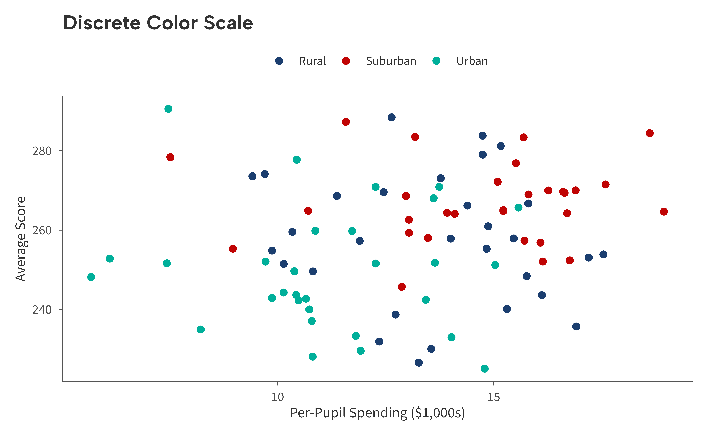
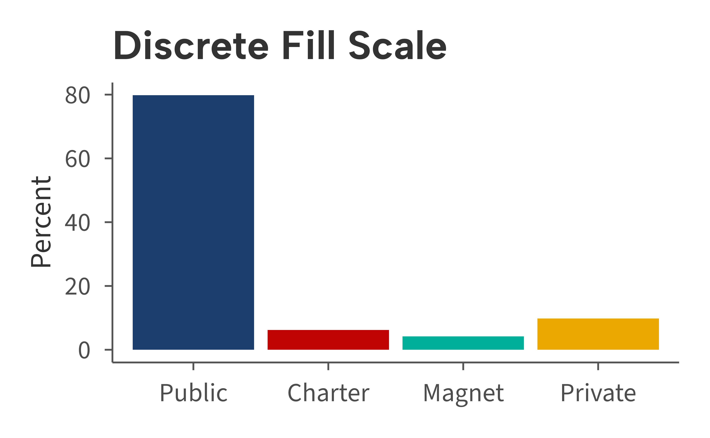
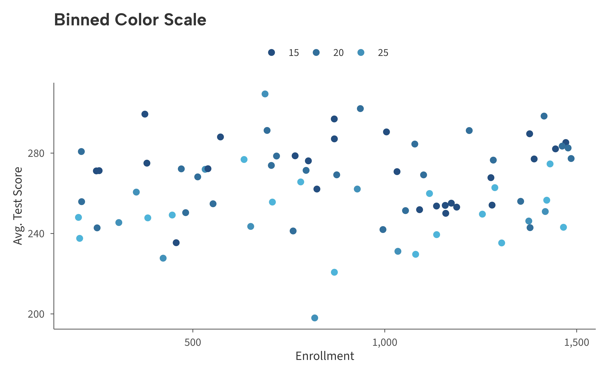
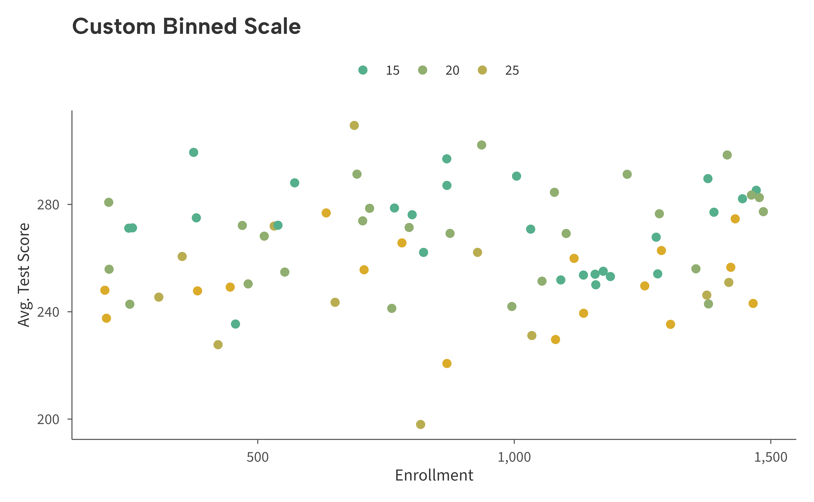
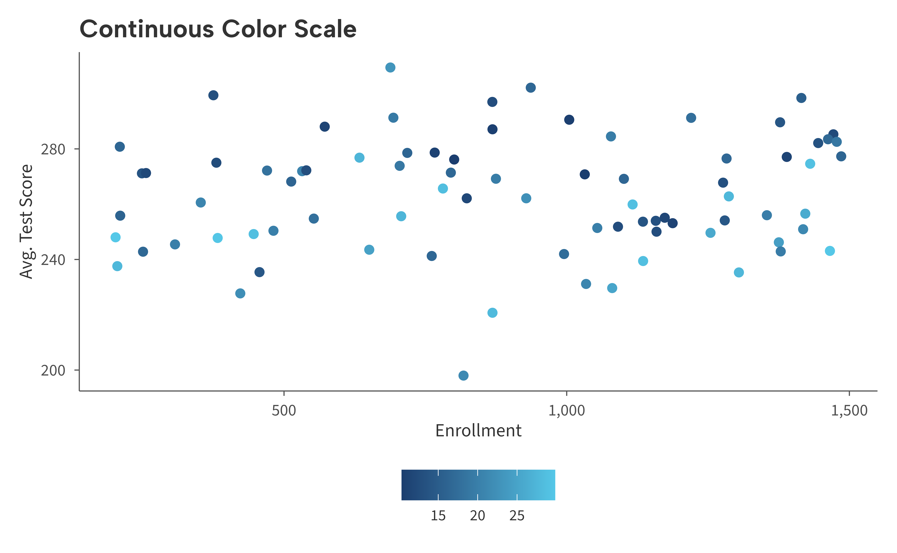
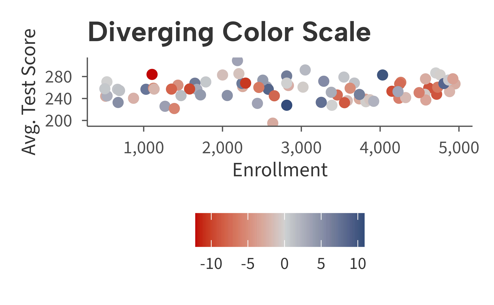
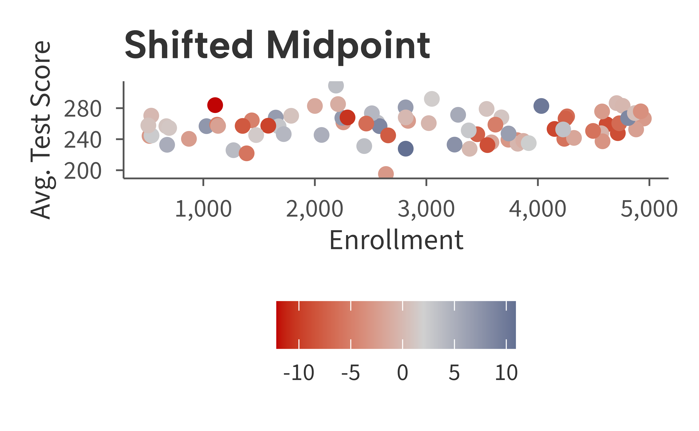

# Color Scales

The ggaib package provides color and fill scales in four flavors:
discrete, binned, continuous, and diverging. Each is available for both
`color` and `fill` aesthetics. All use colors from the AIB brand
palette.

## Discrete

[`scale_color_aib()`](https://andrewmcamp.github.io/ggaib/reference/scale_color_aib.md)
and
[`scale_fill_aib()`](https://andrewmcamp.github.io/ggaib/reference/scale_fill_aib.md)
map categorical variables to the eight-color brand palette. Colors are
ordered for maximum visual contrast.

``` r
# Simulate data
set.seed(42)
districts <- data.frame(
  spending = c(rnorm(30, 11, 2), rnorm(30, 15, 2.5), rnorm(30, 13, 3)),
  avg_score = c(rnorm(30, 250, 15), rnorm(30, 270, 12), rnorm(30, 258, 18)),
  urbanicity = rep(c("Group A", "Group B", "Group C"), each = 30)
)

# Create example figure
ggplot(districts, aes(spending, avg_score, color = urbanicity)) +
  geom_point(size = 2) +
  scale_color_aib() +
  labs(
    title = "Discrete Color Scale",
    x = "Per-Pupil Spending ($1,000s)",
    y = "Average Score"
  ) +
  theme_aib()
```



``` r
# Simulate data
enrollment <- data.frame(
  sector = c("Public", "Charter", "Magnet", "Private"),
  pct = c(0.798, 0.062, 0.042, 0.098)
)
enrollment$sector <- factor(enrollment$sector, levels = enrollment$sector)

# Create example figure
ggplot(enrollment, aes(sector, pct, fill = sector)) +
  geom_col() +
  scale_fill_aib() +
  scale_y_continuous(
    labels = aib_label("percent"),
    limits = c(0, 1)
  ) +
  labs(
    title = "Discrete Fill Scale",
    x = NULL,
    y = "Percent"
  ) +
  theme_aib() +
  theme(legend.position = "none")
```



The palette contains eight colors. If your data has more than eight
levels a warning is issued.

## Binned (Recommended for Continuous Variables)

[`scale_color_aib_b()`](https://andrewmcamp.github.io/ggaib/reference/scale_color_aib_b.md)
and
[`scale_fill_aib_b()`](https://andrewmcamp.github.io/ggaib/reference/scale_fill_aib_b.md)
discretize a continuous variable into bins and display a clean, discrete
legend. This is generally preferred over a smooth gradient because
binned colors are easier to read and compare across data points.

``` r
# Simulate data
set.seed(42)
schools <- data.frame(
  enrollment = runif(80, 200, 1500),
  avg_score = rnorm(80, 260, 20),
  st_ratio = runif(80, 10, 30)
)
schools$avg_score <- schools$avg_score - (schools$st_ratio - 20) * 1.5

# Make example figure
ggplot(schools, aes(enrollment, avg_score, color = st_ratio)) +
  geom_point(size = 2) +
  scale_color_aib_b() +
  scale_x_continuous(labels = aib_label("comma")) +
  labs(
    title = "Binned Color Scale",
    x = "Enrollment",
    y = "Avg. Test Score",
    color = "Student-Teacher\nRatio"
  ) +
  theme_aib()
```



Override the endpoints with `low` and `high`, or control the number of
bins with `n.breaks`:

``` r
ggplot(schools, aes(enrollment, avg_score, color = st_ratio)) +
  geom_point(size = 2) +
  scale_color_aib_b(
    low = aib_colors("emerald"),
    high = aib_colors("yellow"),
    n.breaks = 4
  ) +
  scale_x_continuous(labels = aib_label("comma")) +
  labs(
    title = "Custom Binned Scale",
    x = "Enrollment",
    y = "Avg. Test Score",
    color = "Student-Teacher\nRatio"
  ) +
  theme_aib()
```



## Continuous

[`scale_color_aib_c()`](https://andrewmcamp.github.io/ggaib/reference/scale_color_aib_c.md)
and
[`scale_fill_aib_c()`](https://andrewmcamp.github.io/ggaib/reference/scale_fill_aib_c.md)
create a smooth two-color gradient. These are available when a
continuous colorbar is needed, but in most cases the binned scales above
are a better choice for readability.

``` r
ggplot(schools, aes(enrollment, avg_score, color = st_ratio)) +
  geom_point(size = 2) +
  scale_color_aib_c() +
  scale_x_continuous(labels = aib_label("comma")) +
  labs(
    title = "Continuous Color Scale",
    x = "Enrollment",
    y = "Avg. Test Score",
    color = "Student-Teacher\nRatio"
  ) +
  theme_aib()
```



## Diverging

[`scale_color_aib_div()`](https://andrewmcamp.github.io/ggaib/reference/scale_color_aib_div.md)
and
[`scale_fill_aib_div()`](https://andrewmcamp.github.io/ggaib/reference/scale_fill_aib_div.md)
create a three-color gradient that highlights deviations from a central
value. The default runs from red through light gray to navy, centered at
zero.

``` r
set.seed(42)
districts2 <- data.frame(
  enrollment = runif(80, 500, 5000),
  avg_score = rnorm(80, 255, 20),
  spending_change = rnorm(80, 0, 6)
)

ggplot(districts2, aes(enrollment, avg_score, color = spending_change)) +
  geom_point(size = 2) +
  scale_color_aib_div() +
  scale_x_continuous(labels = aib_label("comma")) +
  labs(
    title = "Diverging Color Scale",
    x = "Enrollment",
    y = "Avg. Test Score",
    color = "Spending\nChange (%)"
  ) +
  theme_aib()
```



Adjust the midpoint or colors as needed:

``` r
ggplot(districts2, aes(enrollment, avg_score, color = spending_change)) +
  geom_point(size = 2) +
  scale_color_aib_div(midpoint = 2) +
  scale_x_continuous(labels = aib_label("comma")) +
  labs(
    title = "Shifted Midpoint",
    x = "Enrollment",
    y = "Avg. Test Score",
    color = "Spending\nChange (%)"
  ) +
  theme_aib()
```



## Summary

| Function                                                                                                                                                                                           | Aesthetic | Type       |
|:---------------------------------------------------------------------------------------------------------------------------------------------------------------------------------------------------|:----------|:-----------|
| [`scale_color_aib()`](https://andrewmcamp.github.io/ggaib/reference/scale_color_aib.md) / [`scale_colour_aib()`](https://andrewmcamp.github.io/ggaib/reference/scale_color_aib.md)                 | color     | Discrete   |
| [`scale_fill_aib()`](https://andrewmcamp.github.io/ggaib/reference/scale_fill_aib.md)                                                                                                              | fill      | Discrete   |
| [`scale_color_aib_b()`](https://andrewmcamp.github.io/ggaib/reference/scale_color_aib_b.md) / [`scale_colour_aib_b()`](https://andrewmcamp.github.io/ggaib/reference/scale_color_aib_b.md)         | color     | Binned     |
| [`scale_fill_aib_b()`](https://andrewmcamp.github.io/ggaib/reference/scale_fill_aib_b.md)                                                                                                          | fill      | Binned     |
| [`scale_color_aib_c()`](https://andrewmcamp.github.io/ggaib/reference/scale_color_aib_c.md) / [`scale_colour_aib_c()`](https://andrewmcamp.github.io/ggaib/reference/scale_color_aib_c.md)         | color     | Continuous |
| [`scale_fill_aib_c()`](https://andrewmcamp.github.io/ggaib/reference/scale_fill_aib_c.md)                                                                                                          | fill      | Continuous |
| [`scale_color_aib_div()`](https://andrewmcamp.github.io/ggaib/reference/scale_color_aib_div.md) / [`scale_colour_aib_div()`](https://andrewmcamp.github.io/ggaib/reference/scale_color_aib_div.md) | color     | Diverging  |
| [`scale_fill_aib_div()`](https://andrewmcamp.github.io/ggaib/reference/scale_fill_aib_div.md)                                                                                                      | fill      | Diverging  |

All scale functions pass additional arguments (`...`) through to the
underlying ggplot2 scale.
