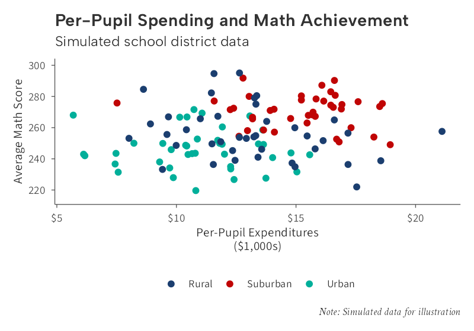

ggplot2 themes and color scales following the visual identity of the Annenberg Institute at Brown University.

<div class="comparison-container">

  
  
</img-comparison-slider>
<p class="comparison-caption">Drag to compare: default ggplot2 (left) vs. ggaib (right)</p>
</div>

## Features

- **[Themes](articles/themes.html)** --- Publication, data-dense, and map variants
- **[Color Scales](articles/color-scales.html)** --- Discrete, continuous, and diverging palettes
- **[Labels](articles/labels.html)** --- Dollar, comma, and percent axis formatters
- **[Palettes](articles/palettes.html)** --- Direct access to brand colors
- **[Font System](articles/fonts.html)** --- Automatic font registration with bundled fallbacks

## Installation

```r
# install.packages("devtools")
devtools::install_github("andrewmcamp/ggaib")
```

## Get started

Read the [introduction vignette](articles/introduction.html) for a guided tour, or browse the [function reference](reference/index.html).
